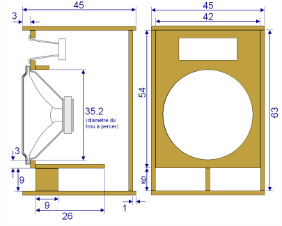

| title | speakers-DIY |
| --- | --- |
| author | GLOXIOU |
| description | A DIY project to build two fairly powerful wooden "head" speakers. A project linked to "subwoofer-DIY" |
| created_at | 2026-09-08 |

# Day 1: Defining system & idea search & inspiration

My goal is to build two wooden "head" speaker cabinets, each consisting of a bass/mid-range module and a high-frequency module. I am aiming for a pair with approximately 300W RMS per speaker, and I plan to use 10-inch woofers along with a compression driver and a horn.

Later on, I also want to build a wooden subwoofer, so this project is linked to [that one](https://github.com/GLOXIOU/subwoofer-DIY).

Today, I’ve just been gathering information. The goal is to put together a kit similar to what L-Acoustics might offer. These speakers are intended for use at events—birthdays, weddings, or private parties. Consequently, they need to be powerful enough for both indoor and outdoor settings, yet compact enough for easy transport. As for the subwoofer, it will be tailored to the music being played—primarily reggae, techno, and other modern party music.

After some research, I’ve decided to base the build on [the box speaker 10-250/8-A](https://www.thomann.fr/the_box_speaker_102508a.htm?gad_source=1&gad_campaignid=1544038022&gbraid=0AAAAADuDMCWqEhEq4n_4zOgVoqLUYxvDH&gclid=Cj0KCQjw5P7UBhDaARIsAOSlS1O6Oam1ZMXhtpK8U2jO1B9wILoDKDmiaS_8sWZ5LIXVSXQzi_hM2LIaAu0UEALw_wcB) drivers for the woofers, [the box pro DSP 115](https://www.thomann.fr/the_box_pro_hochtoener_dsp_115.htm?gad_source=1&gad_campaignid=1544038022&gbraid=0AAAAADuDMCWqEhEq4n_4zOgVoqLUYxvDH&gclid=Cj0KCQjw5P7UBhDaARIsAOSlS1NRoL0ZqlUKUBtIAG-FUjx-qwFdyAcWcUgyI_sR7WdiULvsenBMprMaAozLEALw_wcB) compression drivers, and [Monacor MRH-83 horns 1800Hz–18kHz, 2.5cm diameter](https://www.audiophonics.fr/fr/chambres-de-compression/monacor-mrh-83-pavillon-pour-chambre-de-compression-haut-medium-1800hz-18khz-o25cm-p-1172.html). I should note that this is just an initial selection and is subject to change later on.

The price for these three items is €111.90, or $130.10. The maximum budget per speaker is around $200. That leaves $69.90 for the rest (wood, glue, cables, etc.).

I then turned my attention to the wood design. I think we should use 15 mm birch plywood, which currently costs around €40/m²—or $47/m².

For the internal design of the enclosures, I think I’ll take inspiration from the design I found on [this site](https://www.astuces-pratiques.fr/high-tech/plan-de-construction-d-enceinte-sono) though I know I need to perform calculations based on the selected driver, the horn, and so on. I’ll look into that over the next few days. You can see the image just down this text. Over the next few days, I will also model this design in Fusion 360 to perform calculations more quickly and make modifications more easily.

The question I'm asking myself now is whether to build passive or active speakers. Active would be ideal, but it might not fit the budget. That’s why I’m also considering building an external amplifier myself—not from scratch, but using modules—which could turn out to be cheaper.

**Time spent today:** ~1.5 hours on research, and ~30 minutes on documentation, creating the repo, etc.  
**Total spent:** 2h